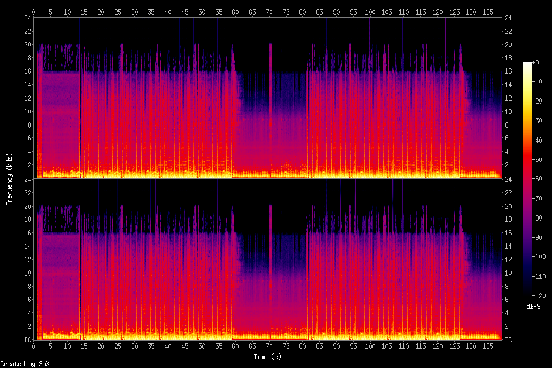
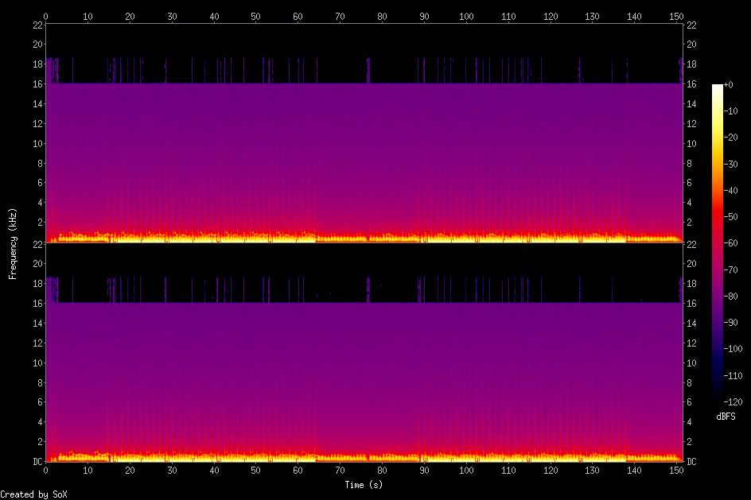

# oxidizer 🎧🤎🌊

An audio transformer that makes everything sound like a Brownian noise ☺️🎧🌊

## Demo 🎧

| Version | Player |
| :--- | :--- |
| **Original** | [original.mp3](https://github.com/user-attachments/assets/a9f8599c-e704-4494-8b8b-e31233a499f6) |
| **Oxidized (Brown)** | [oxidized.mp3](https://github.com/user-attachments/assets/b424db51-79bf-4d74-a72d-f5dc46c6b4e2)|

> **Credits:** Music by **[massobeats - rose water](https://www.youtube.com/watch?v=xakBzg5atsM)**. Processed with oxidizer CLI.

### 📊 Visual Oxidation (Spectrogram Analysis)

The following spectrograms illustrate the frequency response of the algorithm. Notice how the high frequencies (above 16kHz) are attenuated and replaced by the textured Brownian noise floor.

| Original Audio | Oxidized Audio |
| :---: | :---: |
|  |  |
| *Full spectrum detail* | *Warm, low-passed texture* |

## Background

Well, I got bored while studin' for my Psychology exams, so I procrastinated on this side project a bit. Oh, and recently I've realised that constantly listening to the Brown Noise during work keeps me focused.

## 🤎 Brown Noise
In acoustics, **Brown noise** (or Red noise) has a power spectral density that decreases by 6 dB per octave. It is much deeper and bassier than White or Pink noise, similar to the gentle surf that comes with a storm.

It's generally considered as a very soothing and relaxing sound, played by many people to help them fall asleep, relax or focus.

## 🤷 What the heck is this whole "oxidizing" thingamajing?

Oxidizer doesn't just play noise over your music, that wouldn't sound to pleasant :/ It transforms the audio using a "degradation" process. Higher frequencies are the first to dissolve, leaving very deep and warm sound. So it's "degrading" audio and it's written in Rust 🦀, so naming it "oxidizing" seems like a no-brainer 🤡 

Later, the signal is further textured with a **stochastic random walk** (leaky integrator), which adds a gentle background "whoosh," making the track feel more alive and organic.

### The Sound

There are three algorithms implemented, each tailored for a specific use-case:

|Algorithm |Character                            |Best for                                             |
|----------|-------------------------------------|-----------------------------------------------------|
|Light     |Warm and Airy                        |Accentuating vocals while removing digital harshness |
|Brown     |Deep and Mellow                      |Invoking "buried under blankets" feeling             |
|Heavy     |"It's all 'bout the bass, no treble" |Transforming drums into distant, thumping heartbeats |

## 🛠 Roadmap
- [x] Multiple algorithms: Ability to generate an "oxidized" audio with different characteristics.
- [x] Stereo Spread: Independent Brownian generators for Left/Right channels.
- [ ] Wow & Flutter: Subtle pitch modulations to emulate old tape motors.
- [ ] Bit-Crushing: Optional "digital oxidation" for a more lo-fi grit.
- [ ] Custom algorithms: Users can use their own audio transformation algorithms using Lua/Rust/Python scripts or smth, idk. Seems like a challenge to implement tho.

# Installation

Ensure you have the Rust toolchain installed. If not, get it from [rustup.rs](https://rustup.rs/).

## From git

```bash
cargo install --git https://github.com/Sztakler/oxidizer.git
```

## From source

### Clone and Build
```bash
git clone [https://github.com/Sztakler/oxidizer.git](https://github.com/Sztakler/oxidizer.git)
cd oxidizer
cargo build --release
cargo install --path .
```

# ⌨️ Quick Start

```bash
# Basic oxidation using the Brown algorithm
oxidizer -i music.mp3 -o output.wav -a brown -n 0.05

# Deep "Heavy" oxidation with multiple passes
oxidizer -i music.mp3 -o deep_rust.wav -a heavy -n 0.01 -p 2
````

# ⚙️ Built With

- [Rust](https://rust-lang.org/) -- duh.
- [Symphonia](https://github.com/pdeljanov/Symphonia) -- a pure Rust audio decoding library. Used for probing and decoding MP3 files into raw PCM data.
- [Hound](https://github.com/ruuda/hound) -- a WAV encoding and decoding library in Rust. Used to encode transformed PCM data into .wav file.
- [clap](https://docs.rs/clap/latest/clap/) -- bread and butter of CLI argument parsing.


